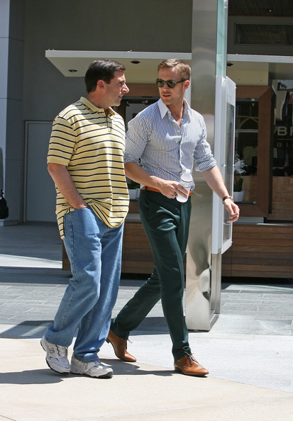

This post was inspired by this fantastically written GQ article, [My Father's Fashion Tips](https://www.gq.com/story/fashion-generation-tips-national-magazine-award).

Dad-core has seen a resurgence in recent years. What was once a blight in the 1980s, where men sported polo shirts, boot-cut jeans or pants, and velcro sneakers, has now been adopted by hipsters and young men alike. Men now wear vintage bucket hats, unironically well-fitting polo shirts, tailored yet wide pants, and New Balance sneakers that were once $20, now $200. All of which are of course sourced from and made in first world countries, and subsequently sold at 500% markup in New York City. Now, logic would dictate that my own father, a man alive during such a trend, would dress like that. And he did! Yet, Darin would claim that he would have evolved beyond that trend. My dad, however, has proven Darwin's theory to be false. Yes, he once donned a thrifted Ralph Lauren Polo shirt with chinos that awkwardly stacked, complemented with a pair of white New Balance sneakers. All in all, he was following the trend at the time, and following the trajectory set out by Darwin's theory of fashion evolution. And looking back, on the topic of his style choices, I always said, “live and let live.” And I still do to this day, and always will, judgment-free. But it is worth saying that my dad has retrograded — no longer does he wear the chinos, nor even pristine sneakers. He still sports the polo shirt, but now exclusively wears sweatpants and what we'll call "broken in" New Balances. It’s a rarity for him to wear chinos, an anomaly to wear a button-down, and an outright miracle to wear a suit (of which I’ve only seen him wear once, to my Bar Mitzvah). And again, I have no problems with his style. I’ve either grown accustomed to it, or unironically think he can pull it off well.

Yet, I find myself on the entire other end of the spectrum. I wouldn't be caught dead wearing sweats of any kind in public — _maybe_ a hoodie, but a well-fitting one to be sure. But I'll admit, I’ll wear sweats inside, that’s not a problem for me. They're comfy, they're easy to take on and off (get your minds out of the gutter), and they're warm in the colder months. But for going out, whether it's work, school, or otherwise, I take pride in my style, wearing boots, sweaters, jackets, coats, all with a puff of confidence in my chest. There's a special sense of irony in having a dad who sees clothes as a means of protecting oneself, and a son who sees clothes as a means of expression -- or as a means of spending money, one or the other. And that irony is only further emphasized when we're walking together. A movie representation sourced from _Crazy, Stupid, Love_ is found below:

Now, unlike the GQ article that inspired me to write this post, I possess neither authentic fashion tips from my dad, nor the writing prowess to do the article justice (both my parents are great writers, don't get it twisted, I'm just not...there yet, we'll say). What I do have, however, is an understanding of his fashion life, which I'll now explore and mine for comedic gain, if we're being honest with each other.

Most recently, my dad found himself in a mid-life crisis. No, he was not questioning his own existence. Nor was he trying to relive his glory years somehow. Ah, no, this crisis was mid-life in a much more literal sense. During the middle of his life, he found himself short on sweatpants. His previous pairs had either been worn out, became adorned with one too many stains, or were turned into sweat-shorts (the horror). Now, I myself would take this as an opportunity to expand my wardrobe, to explore new horizons, and to give myself an excuse to try stuff on. My dad, however, had other plans. For the past three months or so at the time of writing this, he found himself scant of sweatpants (scantpants, if you will), and in need of more. On a journey he went, visiting Bob's, Macy's, Frank's, Jim's, JC Penny, and Nell's (can you guess which ones aren't real stores?). Searching high and low he did, coming up empty-panted each time, seeing his future become grimmer and grimmer. Heck, I even did some of my own searching on Amazon to see what was available. It's hard finding sweatpants! He prefers a loose-fitting pant, and those that fit the bill were far too expensive, going for upwards of \$60. It's sweatpants, it's made from cotton, not from vicuna wool. This is all to say that not only was it a tough search, but also that I helped search, and am therefore free of any guilt as I ramble on about his search.

And then, a development, a break-through, a success: Kohl's. This past November, I'm proud to say, though my father prouder, the search has come to a close. My dad had finally found a pair of sweatpants that he felt would be an adequate replacement. **And**, on deep discount no less (gee, a pair of sweatpants on discount, go figure...). He nabbed those fast as a fox, knowing he had found bliss. A week-long trial commenced, to give them a fair shake, and to make sure they can stand the tests of the gym, house-wear, and the dryer. Upon passing each like a car passing an emissions check, he returned to Kohl's to expand his collection, like a squirrel preparing for hibernation. When I came home for Thanksgiving break, I found myself face to face with five pairs of the same pant. "One for each weekday!" he exclaimed. "But what about weekends?" I asked, genuinely curious as a result of heavy investment in his search. "I'll figure that out later." Lest I scar myself for life, I dropped that line of questioning, and congratulated him on a well-executed and well-done search. And, a small pat on the back for me, knowing that I spent 5 minutes doing my own research.

Now, as a small bit of commentary, I'm genuinely ecstatic for my dad to have replenished his wardrobe. And I do think there is a tip to be found there, if a bit extreme in practice: If you find something nice, consider buying it twice. Maybe not quintice, but certainly twice if the occasion arises. I myself have done that in the past, purchasing a garment of a similar variety to one I already have, knowing the older garment is reaching its golden years. And in some scenarios, buying more than one extra is fine -- if it's on deep discount, and each garment sees equal and heavy use, why not? Now, I wouldn't advocate for something as big as two of the same coat, that might be a bit more indulgent than it is necessary.

Going down memory lane further and further, this sweatpants hunt was not his first rodeo. It was most recently the dearth of the sweatpants (my new book coming out this May), but before that, white New Balance velcro sneakers. That search went on much longer, and consisted of trolling Amazon time and time again to see if a similar model was in stock, as his was discontinued (and that's a whole other rant). And when a similar model had been found, you best believe I was dumbfounded at the huge box at our doorstep. Not one, not two, not three, but four new pairs of New Balances. These hipsters should be so riled up to have men like my dad copping such rarities! And at such low prices, too!

And before the New Balances, socks and underwear, by the handful! Countless pairs, coming in wave after wave. I pray you do not order something yourself during one of these reverse-purges, for ye will be disappointed many times, thinking your package has arrived, only for it to read "Michael Catarevas." "But wait," you counter, "what if the shipping address has his name and not mine, and it's meant for me?" Eagerly, you examine the box, searching for any hint that it's your shipment, wonderment in your eye, a swelling of hope in your heart. "New Balance," the box reads. Deflated and defeated, you retreat, knowing that that day is not your day. Lucky you didn't open the box, right?

On a more serious, yet ironic note, my dad always said to aim for the highest quality version of an item, within reason, of course. To digress for a moment, at some point the ratio of quality to price inverts, and price overtakes quality. No longer is the price worthy of the piece, unless you prefer the brand name over the quality. That aside, what he said has always stuck with me (though he isn't the first to propose this, sad as it is for the patent-holder inside me. See [Samuel Vimes' Boot Theory](https://wiki.lspace.org/mediawiki/Sam_Vimes_Theory_of_Economic_Injustice) for more). There's a hint of irony in this tip: he himself buys the same thing multiple times over, at a cheap price, and has to replace it relatively every so often. I suppose it's a case of "do as I say, not as I do."

I take all of my dad's tips and actions to heart, fully understanding what he does and why. Even though I myself heavily joke with him about his sense of style (and believe you me, I'm not the only one who ribs), I've come to genuinely enjoy his style. I mostly enjoy it because he enjoys it, but a part of me enjoys it because side by side, my style looks better (I'm vain, what can I say)? While he may not be fashionable to the general eye, he'll always have an air of style that no other can match, and I can only hope to one day ascend to his level of fashion and style.
